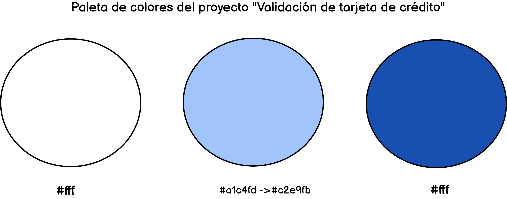
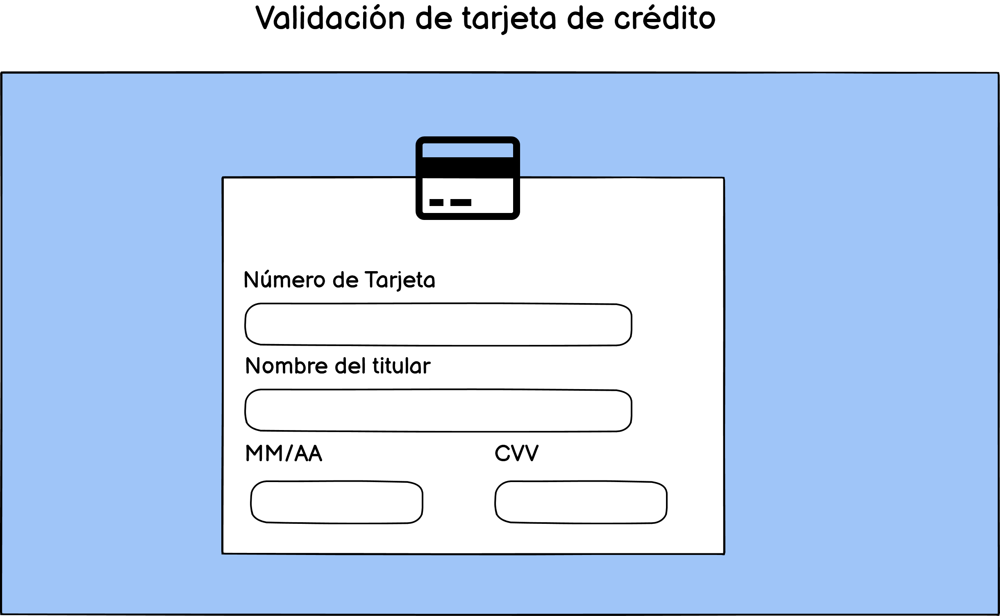
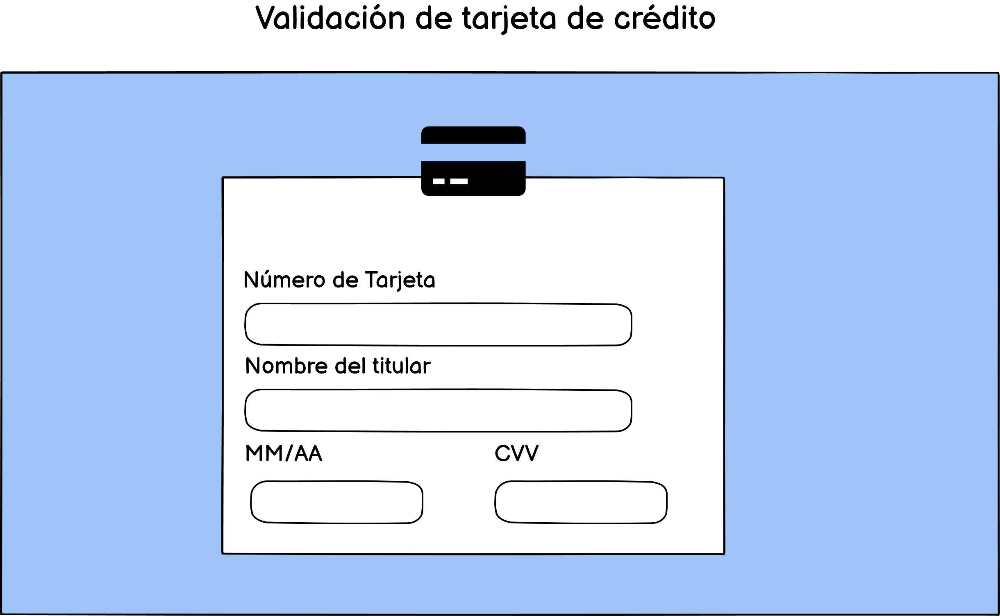
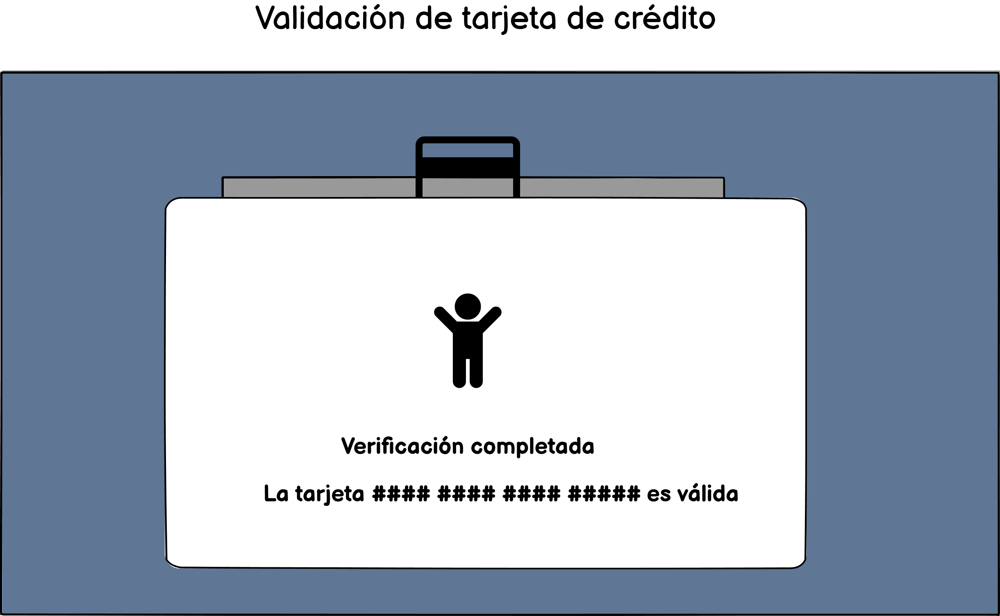

# 1.Tarjeta de crédito válida

Esta página nos permite verificar si la Tarjeta de crédito es válida o no. Actualmente se ha incrementado el
número de compras web, es por eso que se necesita comprobar si el banco ha activado la tarjeta de crédito.
Esta plataforma nos facilita este trabajo y va dirigido a cualquier persona mayor de edad que cuente con tarjeta Visa, Mastercard y American Express.

# 2.Elección de colores y diseño
La elección de colores está basado en 3 colores que muestran un diseño limpio y sencillo que brinda confianza al usuario. Se omitió el uso de alert o ventanas emergentes de colores estridentes, ya que eso podría incomodar al usuario con el temor de que sea un virus.
Los colores que se usaron son los siguientes:

# 3.Maquetación

Tenemos 3 partes :
a. Mostrar la cara delantera de la tarjeta de crédito mientras se completan los datos de Número de tarjeta, nombre de titular y fecha de expiración.

Cara delantera de la tarjeta de crédito.

b. Al completar el campo del CVV la tarjeta se voltea automáticamente, también se puede voltear dando un click a la tarjeta.

Cara trasera de la tarjeta de crédito.

c.Al dar click al botón "Verificar" aparece una ventana Modal que indica si la tarjeta es válida o no.

Activación del modal indicando si la tarjeta es o no válida.

# 4.Resultado Final

El resultado final es el que se muestra en la siguiente imagen. Puede ser fácilmente implementado en bancos, tiendas online, aplicaciones móviles,etc.

# 5. Objetivos de aprendizaje

Los objetivos de aprendizaje de este proyecto son los que se encuentran descritos dentro del ReadMe del proyecto
CreditCard de la promoción LIM015 Laboratoria: https://github.com/Laboratoria/LIM015-card-validation/blob/master/README.md